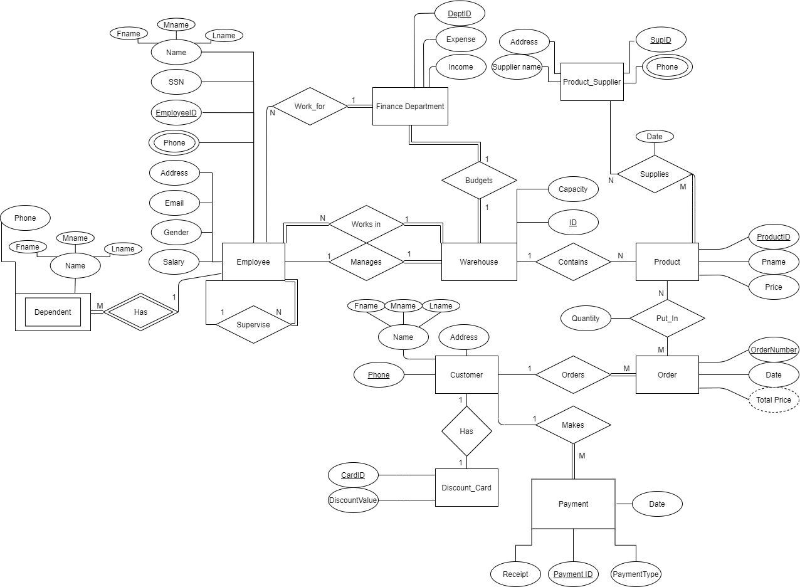
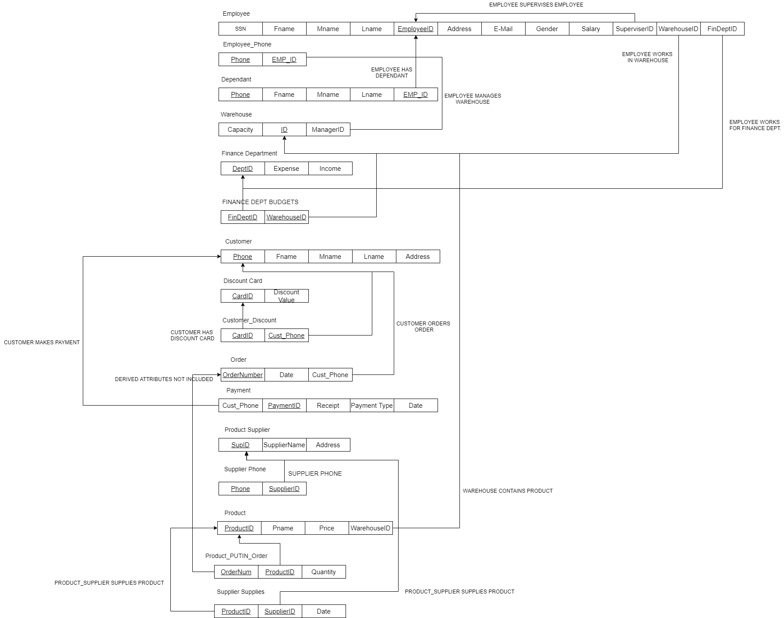

# StockManegmentSystem
My CPIT240 (Database 1) Course Project

## Installation
This database project is concerned about managing (generally) all the aspects of warehouses.
- keeping track of stock, income, and expense. 
- manages and tracks Products, Customers. Payments.
- Saves Orders for future reference.
- Product Suppliers information. 
- information for Finance Department.

# The ER diagram

# The Schema diagram

# Interacting with the database with java GUI application
This part was not fully finished but we did the major parts (adding, deleting)
